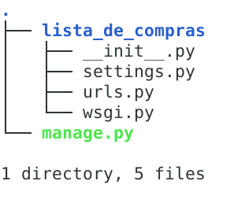

<style>
p {text-indent: 40px; text-align: justify;font-size:20px;}
</style>


# TUTORIAL 01
***
## Usando o terminal.

Crie uma pasta chamada projeto-lista-compras, para isso digite:

```

mkdir  projeto-lista-compras

cd projeto-lista-compras

```

## Instale o virtualenv, caso você ainda não tenha.

```

pip install virtualenv

```

Para criar um ambiente virtual com o nome de .lista


- No Windows

```

virtualenv .lista

.lista\Scripts\activate

```

- No Linux

```

virtualenv .lista

source .lista/bin/activate

```


## Depois de criada e ativada a virtualenv, vamos instalar o Django.

```

pip install django

```

Já podemos criar nosso primeiro projeto.

```

django-admin startproject lista_de_compras . 

```
#### Obs.: Digite os comandos conforme está ai no quadro anterior, com esse ponto no final dando um espaço.

O diretório deve ficar dessa forma.




Agora vamos testar se tudo que fizemos está correto:

```

python manage.py runserver

```
Primeiro APP do sistema.

### Um sistema em django é composto por varios apps, e para criar um APP de forma automatica, digite:

```

python manage.py startapp core 
  
```

#### Obs.: core será o nosso primeiro app, poderia ter outro nome.

***

## Nova etapa.
### Vamos usar uma IDE, aqui no tutorial usarei pycharm.

Entre no pycharm, abrá a pasta lista_de_compras, nela você encontra o arquivo senttings.py, vá até INSTALLED_APPS [] e insira a instrução 'core' no final da lista de acordo com a imagem abaixo:

```

  INSTALLED_APPS = [
    'django.contrib.admin',
    'django.contrib.auth',
    'django.contrib.contenttypes',
    'django.contrib.sessions',
    'django.contrib.messages',
    'django.contrib.staticfiles',
    'core',
]

```

Feito isso vamos criar o modelo da tabela Produto e Categoria,
vá para o diretório core, abra o arquivo models.py e digite:

```

from django.db import models

class Categoria(models.Model):
    descricao = models.CharField(max_length=80)


class Produto(models.Model):
    descricao = models.CharField(max_length=80)
    preco = models.DecimalField(max_digits=10, decimal_places=2)
    quantidade = models.IntegerField()

```


Precisamos registrar esses models no django admin, então ainda no
diretório core abra o arquivo admin.py e digite :

```

from django.contrib import admin
from core.models import Produto, Categoria

admin.site.register(Produto)
admin.site.register(Categoria)

```

Agora precisamos criar os arquivos de migração e aplicar as migrações
no banco de dados para isso acesse o terminal pela sua IDE ou pelo sistema operacional :

```

python manage.py makemigrations

python manage.py migrate

```

Criando o usuario admin para acessar o django Admin:

```

python manage.py createsuperuser

```
#### Obs.: o sistema pede pra que você cadastre o usuario e a senha

## Agora vamos testar o que já fizemos.

```

python manage.py runserver

```

No navegador digite:

```
http://127.0.0.1:4000/admin
```

### Se aparecer a tela de login, então tudo deu certo até aqui...

Digite o login e senha que você acabou de criar e acesse o Django admin.

## ... Continua na PARTE II da série !!!
<br>
<br>
<br>